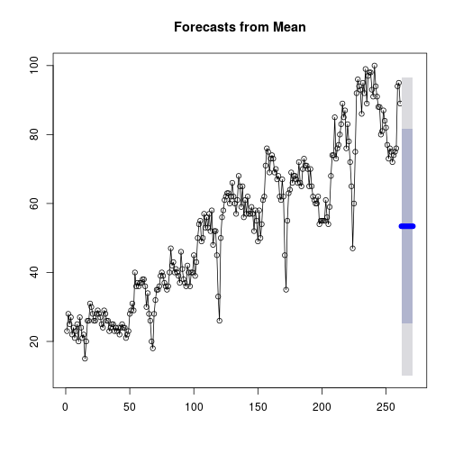

Forecast Simple Models
========================================================
author: Fábio Campos
date: September, 2017
autosize: true

The Forecast Models for Google Trends Search
========================================================

## Overview

This shiny application is for testing some simple forecasting models. We used the Google Trends database for this application using the "gtrendsR" package.
Instructions

## Instructions

To use this application, enter a keyword that interests you, select the forecast template and click on "Run Code".

## Results

Plot Output: See the hits for the keyword searched in Google Trends and the forecasting for this search. The black curve within the predictive area is the training curve.

Summary: Indicates the calculated errors for the applied forecast. This app will have new updates inserting new templates and views.

The Input Information
========================================================

1) Using the gtrendsR package, the user can query some word in Google Trends database. 

2) After that he can choose a Forecast Model (Forecast Package) and click in a Run Code Button. 

Example: 

```r
library(gtrendsR)
library(forecast)
library(tseries)
search <- gtrends("Rstudio")
gt.fc <- search$interest_over_time
fc <- meanf(gt.fc$hits)
```

The Results
========================================================


```r
plot(fc)
lines(gt.fc[,2])
```




```r
accuracy(fc)
```

```
                      ME    RMSE      MAE       MPE     MAPE MASE
Training set 3.26665e-15 21.8885 18.67186 -22.46488 46.36081    1
```


The Screen Application
========================================================


